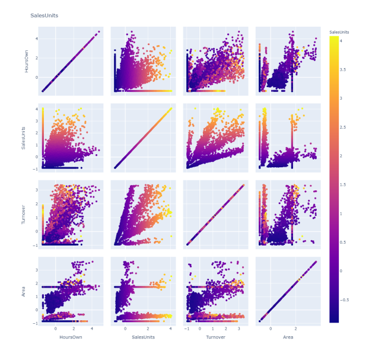

# Data Analysis

This project, includes the implementation of various data analysis methods and compare the result of each implementation for sales prediction and visualization. Data is analized using different approaches inorder to determine which approach works the best
with our data analysis. The main scope is to identify which algorithms give the best result and which algorithms result in poor data prediction. Determining sales units forecasting using feature scaling and dimensionality reduction methods. Data can be affected by many factors that result in irrelevant and redundant data. This noisy or unreliable data can lead to the wrong prediction if it is not handled correctly. Thus the quality of data is the first and foremost stage in data analysis. To obtain exploitable data, the data must be preprocessed before applied to any machine learning algorithm. Preprocessing of data includes data cleaning, data normalization, data transformation, feature extraction, dimensionality reduction, etc. The result of data processing is the final required data for the training algorithm. The final result indicates that no best method can be implemented on all types of datasets. The best sequence for the data preprocessing algorithm depends on the kind of data and its distribution.

## Table of Contents
* [Data Analysis](#data-analysis)
* [3.1 Data Description](#31-data-description)
* [3.2 Data Preprocessing](#32-data-preprocessing) 
  * [3.2.1 Data analysis software tools](#321-data-analysis-software-tools)
  * [3.2.2 Handling Missing Values using Multiple Imputation](#322-handling-missing-values-using-multiple-imputation)
  * [3.2.3 Data Exploration and Visualization](#323-data-exploration-and-visualization) 
* [3.3 Numerical Feature Scaling](#33-numerical-feature-scaling)
  * [3.3.1 Min-Max Normalization](#331-min-max-normalization)
  * [3.3.2 Z-Score Normalization](#332-z-score-normalization)
  * [3.3.3 Robustscaler Normalization](#333-robustscaler-normalization) 
* [3.4 Dimensionality reduction](#34-dimensionality-reduction)
  * [3.4.1 Autoencoder](#341-autoencoder) 
  * [3.4.2 Principal Component Analysis (PCA)](#342-principal-component-analysis-pca)
  * [3.4.3 Truncated Singular Value Decomposition (SVD)](#343-truncated-singular-value-decomposition-svd)
  * [3.4.4 Gaussian Random Projection](#344-gaussian-random-projection)
  * [3.4.5 Sparse Random Projection](#345-sparse-random-projection)
* [3.5 Regression Models](#35-regression-models)
  * [3.5.1 Extreme Gradient Boosting (XGBoost)](#351-extreme-gradient-boosting-xgboost)
  * [3.5.2 Multilayer Perceptron (MLP)](#352-multilayer-perceptron-mlp)
  * [3.5.3 Random Forest](#353-random-forest)
* [3.6 Model Evaluation Metric](#36-model-evaluation-metric)
  * [3.6.1 R-squared](#361-r-squared)
  * [3.6.2 Root Mean Square Error (RMSE)](#362-root-mean-square-error-rmse)
* [4.1 Data Cleaning](#41-data-cleaning)
  * [4.1.1 Data Type Modification](#411-data-type-modification)
  * [4.1.2 Columns Removal and Renaming](#412-columns-removal-and-renaming)
  * [4.1.3 Missing Value Detection](#413-missing-value-detection)
* [4.2 Data Distribution and Exploration](#42-data-distribution-and-exploration)
  * [4.2.1 Data Distribution with Min-Max Normalization](#421-data-distribution-with-min-max-normalization)
  * [4.2.2 Data Distribution with Z-Score Normalization](#422-data-distribution-with-z-score-normalization)
  * [4.2.3 Data Distribution with Robustscaler Normalization](#423-data-distribution-with-robustscaler-normalization)
* [4.3 Correlation between features](#43-correlation-between-features)
* [4.4 Feature Scaling and Dimensionality Reduction](#44-feature-scaling-and-dimensionality-reduction)
  * [4.4.1 Feature Scaling followed by Autoencoder Dimensionality Reudction](#441-feature-scaling-followed-by-autoencoder-dimensionality-reudction)
  * [4.4.2 Feature Scaling followed by Principal Component Analysis (PCA)](#442-feature-scaling-followed-by-principal-component-analysis-pca)
  * [4.4.3 Feature Scaling followed by Truncated Singular Value Decomposition (Truncated SVD)](#443-feature-scaling-followed-by-truncated-singular-value-decomposition-truncated-svd)
  * [4.4.4 Feature Scaling followed by Gaussian Random Projection](#444-feature-scaling-followed-by-gaussian-random-projection)
  * [4.4.5 Feature Scaling followed by Sparse Random Projection](#445-feature-scaling-followed-by-sparse-random-projection)
* [5 Results and Discussion](#5-results-and-discussion)

## 3.1 Data Description 
3.1 Overview of the top 5 entries of the dataset 

## 3.2 Data Preprocessing 

3.2 Architecture of data preprocessing flow chart 

### 3.2.1 Data analysis software tools 
### 3.2.2 Handling Missing Values using Multiple Imputation 

### 3.2.3 Data Exploration and Visualization 
## 3.3 Numerical Feature Scaling 
### 3.3.1 Min-Max Normalization 
### 3.3.2 Z-Score Normalization 
### 3.3.3 Robustscaler Normalization 
## 3.4 Dimensionality reduction 
### 3.4.1 Autoencoder 

3.3 Autoencoder architecture 

### 3.4.2 Principal Component Analysis (PCA) 

### 3.4.3 Truncated Singular Value Decomposition (SVD) 

3.4 Truncated Singular Values Decomposition 

### 3.4.4 Gaussian Random Projection 

### 3.4.5 Sparse Random Projection 
## 3.5 Regression Models 
### 3.5.1 Extreme Gradient Boosting (XGBoost) 
### 3.5.2 Multilayer Perceptron (MLP) 
### 3.5.3 Random Forest 
## 3.6 Model Evaluation Metric 
### 3.6.1 R-squared 
### 3.6.2 Root Mean Square Error (RMSE)
## 4.1 Data Cleaning 
### 4.1.1 Data Type Modification 

4.1 Data type before cleaning 

### 4.1.2 Columns Removal and Renaming 
### 4.1.3 Missing Value Detection 

4.2 Percentage of missing values 

4.3 Nullity Matrix 

4.4 Heat map 

4.5 dendrogram of missing data 

## 4.2 Data Distribution and Exploration 

4.6 Probability Density of a continuous variable distribution

4.7 Bar graph for monthly sales distribution vs. country of sales

4.8 Bar graph for monthly sales distribution vs. sales item

4.9 Bar graph for monthly sales distribution vs. city of sales

4.10 Scatter plot for HoursLease vs. HoursOwn

4.11 Scatter pair plot of continuous variables

4.12 Boxplots for sales Units vs. Department name

4.13 Boxplots for Hours own vs. Department name 

4.14 Boxplots for Hours Lease vs. Department name 

4.15 Boxplots for Turnover vs. Department name 

4.16 Boxplots for Area vs. Department name 

### 4.2.1 Data Distribution with Min-Max Normalization 

4.17 Data distribution after minmax normalization 

4.20 Scatter pair plot after minmax normalization 

### 4.2.2 Data Distribution with Z-Score Normalization 

4.18 Data distribution after Z-Score Normalization 

4.21 Scatter pair plot after Z-score Normalization 

### 4.2.3 Data Distribution with Robustscaler Normalization 

4.19 Data distribution after Robustscaler Normalization

4.22 Scatter pair plot after Robustscaler normalization 

## 4.3 Correlation between features 

4.23 Heatmap of continuous variables 

## 4.4 Feature Scaling and Dimensionality Reduction 

### 4.4.1 Feature Scaling followed by Autoencoder Dimensionality Reudction 

4.24 Scatter plot of Autoencoder with Normalization 

4.25 Scatter plot of Auroencoder with Robustscaler Normalization 

4.26 Scatter plot of Autoencoder with Standardization 

### 4.4.2 Feature Scaling followed by Principal Component Analysis (PCA) 

4.27 Scater plot of PCA with Normalization 

4.28 Scatter plot of PCA with RobustScaler 

4.29 Scatter plot of PCA with Standardization 

### 4.4.3 Feature Scaling followed by Truncated Singular Value Decomposition (Truncated SVD) 

4.30 Scatter plot of Truncated SVD after Normalization 

4.31 Scatter plot of Truncated SVD with RobustScaler 

4.32 Scatter plot of Truncated SVD with Standardization 

### 4.4.4 Feature Scaling followed by Gaussian Random Projection 

4.33 Scater plot of Gaussian Random Projection with normalization 

4.34 Scatter plot of Gaussian Random Projection with RobustScaler 

4.35 Scatter plot of Gaussian Random Projection with Z-score normalization

### 4.4.5 Feature Scaling followed by Sparse Random Projection 

4.36 Scatter plot of Sparse Random Projection with Normalization 

4.37 Scatter plot of Sparse Random Projection with RobustScaler 

4.38 Scatter plot of Sparse Random Projection with Standardization

## 5 Results and Discussion
 
5.1 R-squared value for minmax normalized data with different dimensionality reduction methods on three models

5.2 R-squared value for Robustscaler normalized data with different dimensionality reduction methods on three models

5.3 R-squared value for Z score standardized data with different dimensionality reduction methods on three models 

5.4 RMSE value for minmax normalized data with different dimensionality reduction methods on three models 

5.5 RMSE value for Robustscaler normalized data with different dimensionality reduction methods on three models 

5.6 RMSE value for Z score standardized data with different dimensionality reduction methods on three models 

